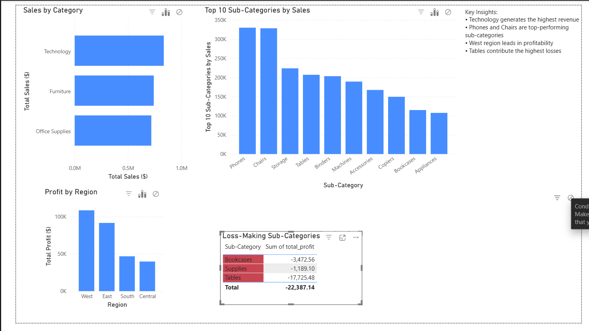

# Retail Sales Analytics Dashboard

## 📊 Project Overview

This project analyzes retail sales data to identify key trends, profitability drivers, and underperforming products. The goal is to generate actionable business insights using SQL, Python, and Power BI.

---

## 📸 Dashboard Preview

---

## ⚙️ Tech Stack

* SQL (Joins, Aggregations, Data Analysis)
* Python (Pandas for data validation and preprocessing)
* Power BI (Dashboard development and visualization)
* Excel (Data exploration)

---

## 📁 Project Structure

* **data/** → Raw dataset and database files
* **sql/** → SQL queries used for analysis
* **reports/** → Generated outputs and insights
* **scripts/** → Python scripts for data checks and validation
* **images/** → Dashboard screenshots

---

## 🔍 Key Analysis

* Sales performance by category
* Top-performing sub-categories
* Profitability by region
* Identification of loss-making products

---

## 💡 Key Insights

* Technology generates the highest revenue
* Phones and Chairs are top-performing sub-categories
* West region leads in profitability
* Tables contribute the highest losses

---

## 🚀 How to Run

1. Load the dataset into your database
2. Execute SQL queries from the `sql/` folder
3. Review outputs in the `reports/` folder
4. Use Power BI to visualize results

---

## 📌 Outcome

Developed an end-to-end analytics solution to transform raw retail data into business insights, supporting data-driven decision-making and operational improvements.

